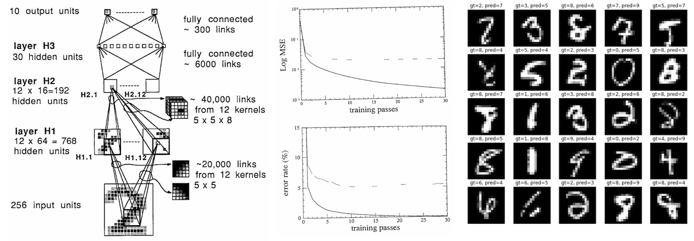

# lecun1989-repro

*[English README is here → `README.md`](README.md)*



このコードは 1989 年の Yann LeCun ほかの論文 [Backpropagation Applied to Handwritten Zip Code Recognition](http://yann.lecun.com/exdb/publis/pdf/lecun-89e.pdf) の再現を試みるものです。私の知る限り、これは誤差逆伝播法で訓練されたニューラルネットの、実世界における最も初期の応用です（今から 33 年前）。

> **注:** このリポジトリには C++ への移植版も含まれています。ビルド方法や、学習・保存済みモデルからの推論・画像ファイルからの数字認識（`predict`）については [`cpp/README.ja.md`](cpp/README.ja.md) を参照してください。

#### 実行

論文で使われた正確なデータセットは手元にないため、MNIST から例をランダムに選んでデータセットの近似を生成します。これは訓練 7291 枚・テスト 2007 枚のみ、サイズも 16x16 ピクセルのみです（標準の MNIST は 28x28）。

```
$ python prepro.py
```

これで論文の再現に挑戦できます。元のネットワークは 3 日かけて学習しましたが、33 年後の私の（Apple Silicon M1）MacBook Air はおよそ 90 秒で処理し切ります。（エミュレーションなしの arm64 ですが CPU のみ。PyTorch と Apple M1 はまだ完全にベストフレンドとは言えないと思いますが、ともあれ約 3000 倍の高速化です。）prepro を実行したので、いよいよ repro を実行できます！（笑）

```
$ python repro.py
```

これを実行すると（23 回目、最終パスで）次のように表示されます。

```
eval: split train. loss 4.073383e-03. error 0.62%. misses: 45
eval: split test . loss 2.838382e-02. error 4.09%. misses: 82
```

これは論文の報告値に近いですが、完全に同じではありません。論文と正確に一致させるなら、代わりに次のような値が期待されます。

```
eval: split train. loss 2.5e-3. error 0.14%. misses: 10
eval: split test . loss 1.8e-2. error 5.00%. misses: 102
```

この差異の大部分は訓練データセットそのものに由来すると考えています。私たちは 33 年後の今日入手できるもの（MNIST）を使って元のデータセットを模倣したにすぎません。論文で明記されていない細部も多く、いくつか推測せざるを得ませんでした（下記のメモ参照）。たとえば H1 層と H2 層の間の具体的な疎結合の構造は説明されておらず、論文は入力が「ここでは論じない方式に従って選ばれる」と述べるにとどまります。また論文は「ヘッセ行列の正の対角近似を用いるニュートン法の特別版」を使っていますが、本実装では単純な SGD のみを使いました。そのほうがはるかに簡単で、しかも論文によれば「このアルゴリズムが学習速度を劇的に向上させるとは考えられていない」からです。ともあれ、同程度のオーダーの数値は得られています……。

#### メモ

論文からの私のメモ:

- 訓練に 7291 枚の数字を使用
- テストに 2007 枚の数字を使用
- 各画像は 16x16 ピクセルのグレースケール（2 値ではない）
- 画像は [-1, 1] の範囲にスケーリング
- ネットワークは 3 つの隠れ層 H1 H2 H3 を持つ
    - H1 は 5x5 ストライド 2 の畳み込みで 12 面。-1 の定数パディング。
    - 「標準的でない」点: ユニットはバイアスを共有しない！（同じ特徴面の中でも）
    - H1 は 768 ユニット（8\*8\*12）、19,968 結合（768\*26）、1,068 パラメータ（768 バイアス + 25\*12 重み）
    - 「標準的でない」点: H2 のユニットはすべて 5x5 ストライド 2 の畳み込みから入力を得るが、それぞれ 12 面のうち異なる 8 面だけに接続する
    - H2 は 192 ユニット（4\*4\*12）、38,592 結合（192 ユニット × 201 入力線）、2,592 パラメータ（12 × 200 重み + 192 バイアス）
    - H3 は 30 ユニットで H2 に全結合。よって 5790 結合（30 × 192 + 30）
    - 出力層は 10 ユニットで H3 に全結合。よって 310 重み（30 × 10 + 10）
    - 合計: 1256 ユニット、64,660 結合、9760 パラメータ
- 全ユニットで tanh 活性化（出力ユニットも！）
    - 出力の重みは準線形領域に入るように選ぶ
- コスト関数: 平均二乗誤差
- 重み初期化: U[-2.4/F, 2.4/F] の乱数（F はファンイン）。「総入力をシグモイドの動作範囲に保つ傾向がある」
- 学習
    - パターンは一定の順序で提示
    - 1 例ずつの SGD
    - ヘッセ行列の正の対角近似を用いるニュートン法の特別版を使用
    - データを 23 パス学習し、各パス後に訓練・テスト誤差を測定。合計 167,693 回の提示（23 × 7291）
    - 最終誤差: 訓練 2.5e-3、テスト 1.8e-2
    - 誤分類率: 訓練 0.14%（10 個の誤り）、テスト 5.0%（102 個の誤り）
- 計算環境:
    - SUN-4/260 ワークステーションで実行
    - デジタル信号コプロセッサ:
        - ローカルメモリ 256 kbytes
        - fp32 でピーク性能 12.5M MAC/s（すなわち 25MFLOPS）
    - 3 日間学習
    - スループット 10〜12 数字/秒。「主に正規化ステップによって制限される」
    - 正規化済みの数字では 30 数字/秒
- 「大規模で実世界のタスクに誤差逆伝播学習をうまく適用できた」

**未解決の問い:**

- H2 から H1 への 12 → 8 の接続は本論文で説明されていない……妥当なブロック構造の結合を仮定する
- 「MSE 損失」が正確に何を指すのか不明。勾配計算を簡単にするための 1/2 のスケール係数は含まれていたのか？ 含まれていないと仮定する
- 学習率はいくつか？ スイープを実行して手動で最良のものを決める
- 学習率の減衰は使われたか？ 言及なし。使っていないと仮定する
- 重み減衰は使われたか？ 言及なし。使っていないと仮定する
- 重み初期化で、ファンインに平方根が付くべきなのに pdf のバグでは？ pdf の書式が少し崩れている。付くと仮定する
- 論文には書かれていないが、ターゲットは正確には何か？ 出力ユニットも tanh なので、正例/負例に対して +1/-1 と仮定する

重み初期化の難題についてもう一つ。たとえば「Kaiming 初期化」は次の通りです。

```
a = gain * sqrt(3 / fan_in)
~U(-a, a)
```

tanh ニューロンでは推奨される gain は 5/3 です。したがって `a = sqrt(3) * 5 / 3 * sqrt(1 / fan_in) = 2.89 * sqrt(1 / fan_in)` となり、これは論文が行っていること（gain 2.4）に近いです。つまり、もし元の研究が実際に平方根を使っていて pdf の書式だけが崩れているのだとすれば、（現代の）Kaiming 初期化と当時使われた初期化はかなり近いことになります。

#### TODO

- 33 年分のタイムトラベルで得た知識を使ってネットワークを現代化する。
- 学習率調整のための、私の雑なハイパーパラメータ・スイープコードを含める（かもしれない）。
